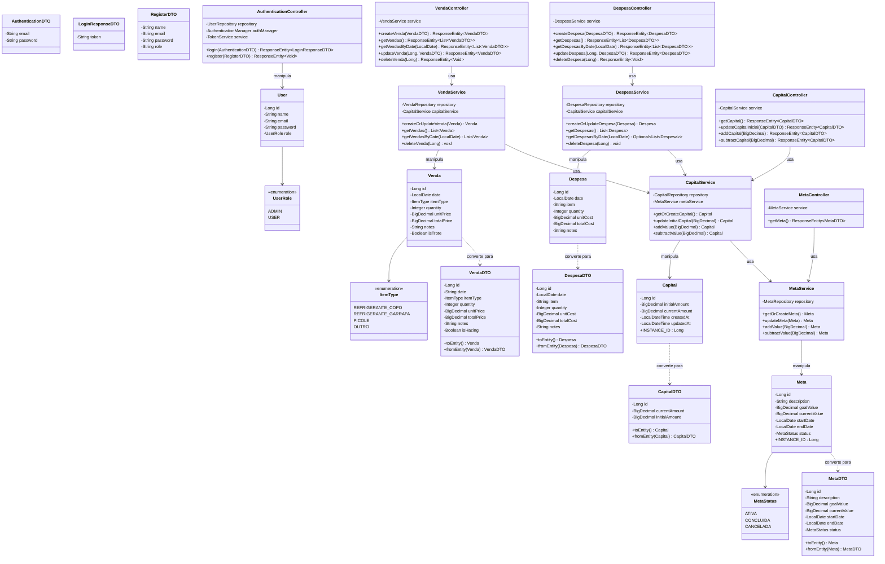
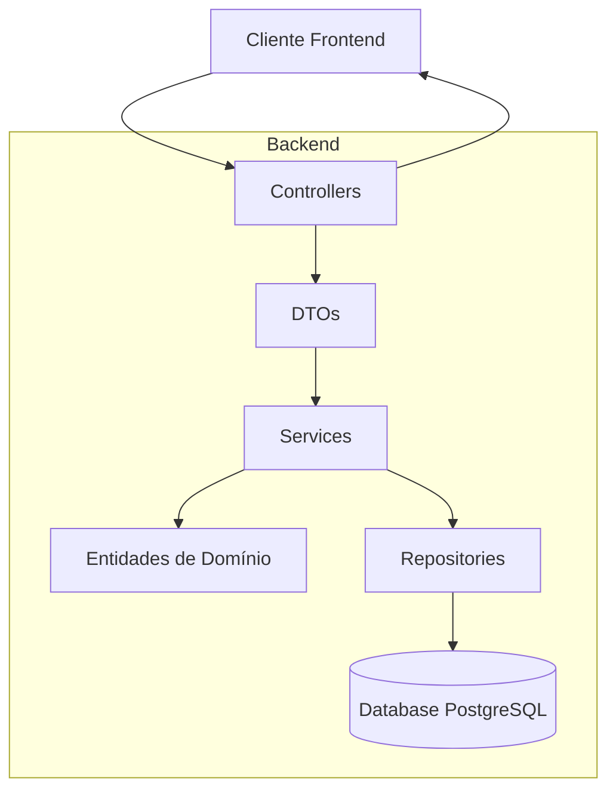

# Contador Comitê - Sistema de Gestão Financeira para Comitê de Formatura

## Visão Geral

O Contador Comitê é uma aplicação full-stack desenvolvida para facilitar a gestão financeira de comitês de formatura. A plataforma permite o controle intuitivo de receitas e despesas, monitoramento de vendas diárias, acompanhamento de metas financeiras e geração de relatórios analíticos.

Desenvolvido com tecnologias modernas, o sistema oferece uma interface amigável para membros do setor financeiro registrarem vendas, acompanharem o progresso em relação às metas e gerenciarem o fluxo de caixa.

## Funcionalidades Implementadas

### Gestão de Capital
✅ Controle do capital total disponível  
✅ Registro de capital inicial para início do monitoramento  
✅ Operações de adição e subtração de valores do capital

### Gestão de Metas
✅ Definição de metas financeiras com valores, descrições e prazos  
✅ Acompanhamento do progresso em direção às metas  
✅ Monitoramento de status das metas (em andamento, concluída, etc.)

## Funcionalidades Planejadas

### Registro de Vendas
🔄 Contadores para diferentes produtos (refri copo, refri garrafa, picolé)  
🔄 Marcação de "dia de trote" com contadores especiais (bingo, cadeia do amor, correio elegante)  
🔄 Registro de vendas customizadas e exceções

### Registro de Despesas
🔄 Cadastro de despesas com insumos (picolés, fardos de refrigerante)  
🔄 Controle de despesas diversas

### Visualização e Análise
🔄 Calendário semanal até a data final de pagamento da formatura  
🔄 Gráficos de receitas e lucros por dia  
🔄 Sumário financeiro e acompanhamento de metas

## Arquitetura do Sistema

### Backend (Implementado)
- Java com Spring Boot (API REST)
- Banco de dados PostgreSQL
- Armazenamento em AWS RDS

### Frontend (Planejado)
- Vue.js com TypeScript
- Vuex para gerenciamento de estado
- Interface responsiva e intuitiva

## Modelo de Domínio
### Diagrama de Classes Atual


### Diagrama da Arquitetura do Sistema
```mermaid
classDiagram
    %% Camadas da Arquitetura
    namespace Apresentação {
        class CapitalController
        class MetaController
        class VendaController
        class DespesaController
        class AuthenticationController
    }
    
    namespace Aplicação {
        class CapitalService
        class MetaService
        class VendaService
        class DespesaService
        class TokenService
    }
    
    namespace Domínio {
        class Capital
        class Meta
        class Venda
        class Despesa
        class User
        class ItemType
        class MetaStatus
        class UserRole
    }
    
    namespace Infraestrutura {
        class CapitalRepository
        class MetaRepository
        class VendaRepository
        class DespesaRepository
        class UserRepository
    }
    
    namespace DTOs {
        class CapitalDTO
        class MetaDTO
        class VendaDTO
        class DespesaDTO
        class AuthenticationDTO
        class LoginResponseDTO
        class RegisterDTO
    }
    
    %% Relações entre camadas
    Apresentação --> Aplicação : usa
    Aplicação --> Domínio : manipula
    Aplicação --> Infraestrutura : usa
    Domínio ..> DTOs : converte para
```

### Fluxo de Dados do Sistema


## API Endpoints Implementados

### Capital
- `GET /api/capital` - Obtém informações do capital atual
- `PUT /api/capital/initial` - Atualiza o valor do capital inicial
- `PUT /api/capital/current/add` - Adiciona valor ao capital atual
- `PUT /api/capital/current/subtract` - Subtrai valor do capital atual

### Vendas
- `GET /api/vendas` - Obtém todas as vendas
- `GET /api/vendas/{date}` - Obtém vendas por data (formato dd-MM-yyyy)
- `POST /api/vendas` - Registra uma nova venda
- `PUT /api/vendas/{id}` - Atualiza uma venda existente
- `DELETE /api/vendas/{id}` - Remove uma venda

### Despesas
- `GET /api/despesas` - Obtém todas as despesas
- `GET /api/despesas/{date}` - Obtém despesas por data (formato dd-MM-yyyy)
- `POST /api/despesas` - Registra uma nova despesa
- `PUT /api/despesas/{id}` - Atualiza uma despesa existente
- `DELETE /api/despesas/{id}` - Remove uma despesa

### Meta
- `GET /api/meta` - Obtém informações da meta atual

### Autenticação
- `POST /api/auth/login` - Autentica um usuário
- `POST /api/auth/register` - Registra um novo usuário

## Configuração e Execução

### Pré-requisitos
- Java 17+
- PostgreSQL
- Maven

### Configuração
1. Clone o repositório
2. Configure as credenciais do banco de dados em `application.properties`
3. Execute o backend com `mvn spring-boot:run`

## Próximos Passos
- Implementação de módulos de venda e despesa
- Desenvolvimento do frontend em Vue.js
- Implementação de autenticação e autorização
- Desenvolvimento de dashboards analíticos
- Implementação de relatórios exportáveis

## Sobre o Projeto

Este projeto foi desenvolvido para auxiliar o comitê de formatura do terceiro ano na gestão financeira, com o objetivo principal de arrecadar fundos suficientes para custear a colação de grau de aproximadamente 100 alunos, que representa um custo estimado de R$ 120,00 por aluno (no primeiro lote, sujeito a aumentos nos lotes seguintes).

Projeto em desenvolvimento ativo. Contribuições são bem-vindas!
