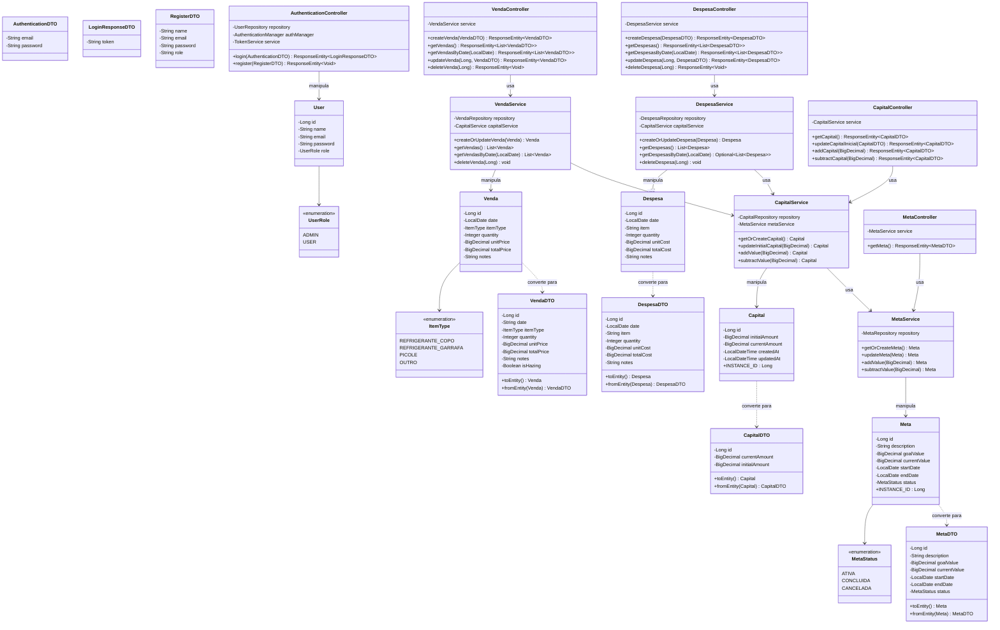
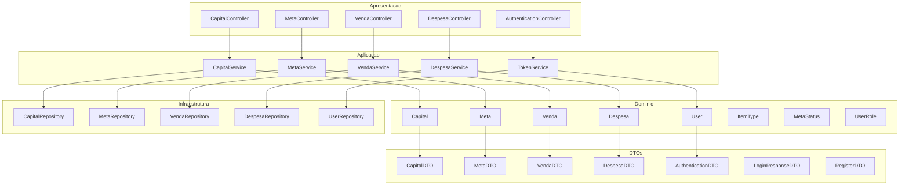
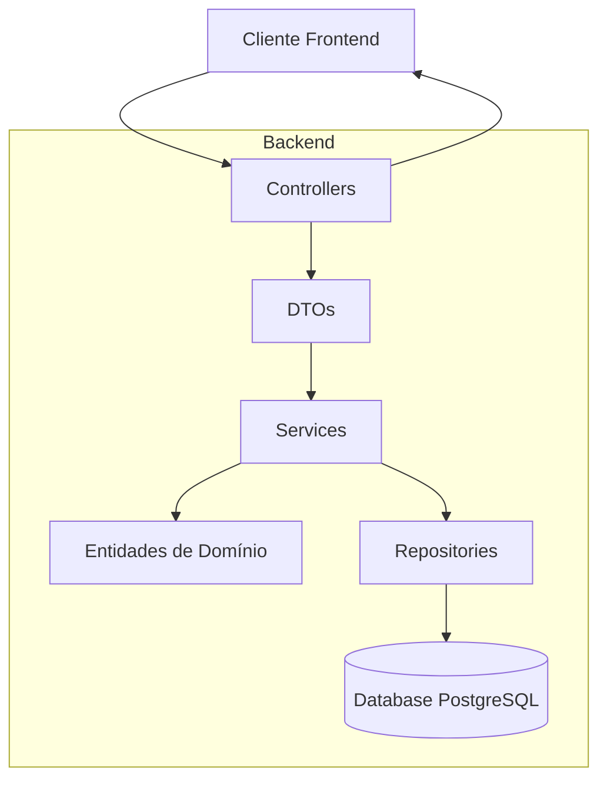

# Contador Comitê - Sistema de Gestão Financeira para Comitê de Formatura

## Visão Geral

O Contador Comitê é uma aplicação full-stack desenvolvida para facilitar a gestão financeira de comitês de formatura. A plataforma permite o controle intuitivo de receitas e despesas, monitoramento de vendas diárias, acompanhamento de metas financeiras e geração de relatórios analíticos.

Desenvolvido com tecnologias modernas, o sistema oferece uma interface amigável para membros do setor financeiro registrarem vendas, acompanharem o progresso em relação às metas e gerenciarem o fluxo de caixa.

## Funcionalidades Implementadas

### Gestão de Capital
✅ Controle do capital total disponível  
✅ Registro de capital inicial para início do monitoramento  
✅ Operações de adição e subtração de valores do capital

### Gestão de Metas
✅ Definição de metas financeiras com valores, descrições e prazos  
✅ Acompanhamento do progresso em direção às metas  
✅ Monitoramento de status das metas (em andamento, concluída, etc.)

## Funcionalidades Planejadas

### Registro de Vendas
🔄 Contadores para diferentes produtos (refri copo, refri garrafa, picolé)  
🔄 Marcação de "dia de trote" com contadores especiais (bingo, cadeia do amor, correio elegante)  
🔄 Registro de vendas customizadas e exceções

### Registro de Despesas
🔄 Cadastro de despesas com insumos (picolés, fardos de refrigerante)  
🔄 Controle de despesas diversas

### Visualização e Análise
🔄 Calendário semanal até a data final de pagamento da formatura  
🔄 Gráficos de receitas e lucros por dia  
🔄 Sumário financeiro e acompanhamento de metas

## Arquitetura do Sistema

### Backend (Implementado)
- Java com Spring Boot (API REST)
- Banco de dados PostgreSQL
- Armazenamento em AWS RDS

### Frontend (Planejado)
- Vue.js com TypeScript
- Vuex para gerenciamento de estado
- Interface responsiva e intuitiva

## Modelo de Domínio
### Diagrama de Classes Atual


### Diagrama da Arquitetura do Sistema


### Fluxo de Dados do Sistema


## API Endpoints Implementados

### Capital
- `GET /api/capital` - Obtém informações do capital atual
- `PUT /api/capital/initial` - Atualiza o valor do capital inicial
- `PUT /api/capital/current/add` - Adiciona valor ao capital atual
- `PUT /api/capital/current/subtract` - Subtrai valor do capital atual

### Vendas
- `GET /api/vendas` - Obtém todas as vendas
- `GET /api/vendas/{date}` - Obtém vendas por data (formato dd-MM-yyyy)
- `POST /api/vendas` - Registra uma nova venda
- `PUT /api/vendas/{id}` - Atualiza uma venda existente
- `DELETE /api/vendas/{id}` - Remove uma venda

### Despesas
- `GET /api/despesas` - Obtém todas as despesas
- `GET /api/despesas/{date}` - Obtém despesas por data (formato dd-MM-yyyy)
- `POST /api/despesas` - Registra uma nova despesa
- `PUT /api/despesas/{id}` - Atualiza uma despesa existente
- `DELETE /api/despesas/{id}` - Remove uma despesa

### Meta
- `GET /api/meta` - Obtém informações da meta atual

### Relatórios
- `GET /api/reports` - Gera relatórios financeiros

### Autenticação
- `POST /api/auth/login` - Autentica um usuário
- `POST /api/auth/register` - Registra um novo usuário

## Documentação Detalhada da API

### Endpoints de Capital

#### Obter capital atual
```
GET /api/capital
```

**Resposta:**
- Status: 200 OK
- Corpo:
```json
{
  "id": 1,
  "currentAmount": 5000.00,
  "initialAmount": 2000.00
}
```

#### Atualizar capital inicial
```
PUT /api/capital/initial
```

**Requisição:**
```json
{
  "initialAmount": 2500.00
}
```

**Resposta:**
- Status: 200 OK
- Corpo:
```json
{
  "id": 1,
  "currentAmount": 5000.00,
  "initialAmount": 2500.00
}
```

#### Adicionar valor ao capital
```
PUT /api/capital/current/add
```

**Requisição:**
```json
500.00
```

**Resposta:**
- Status: 200 OK
- Corpo:
```json
{
  "id": 1,
  "currentAmount": 5500.00,
  "initialAmount": 2500.00
}
```

#### Subtrair valor do capital
```
PUT /api/capital/current/subtract
```

**Requisição:**
```json
300.00
```

**Resposta:**
- Status: 200 OK
- Corpo:
```json
{
  "id": 1,
  "currentAmount": 5200.00,
  "initialAmount": 2500.00
}
```

### Endpoints de Meta

#### Obter meta atual
```
GET /api/meta
```

**Resposta:**
- Status: 200 OK
- Corpo:
```json
{
  "id": 1,
  "description": "Meta para formatura",
  "goalValue": 14520.00,
  "currentValue": 5200.00,
  "startDate": "2023-09-01",
  "endDate": "2025-08-29",
  "status": "ATIVA"
}
```

### Endpoints de Vendas

#### Listar todas as vendas
```
GET /api/vendas
```

**Resposta:**
- Status: 200 OK
- Corpo:
```json
[
  {
    "id": 1,
    "date": "17/09/2023",
    "itemType": "REFRI_COPO",
    "quantity": 50,
    "unitPrice": 3.00,
    "totalPrice": 150.00,
    "notes": "Venda no intervalo"
  },
  {
    "id": 2,
    "date": "17/09/2023",
    "itemType": "PICOLE",
    "quantity": 20,
    "unitPrice": 5.00,
    "totalPrice": 100.00,
    "notes": "Venda na saída"
  }
]
```

#### Buscar vendas por data
```
GET /api/vendas/{date}
```

**Parâmetros:**
- `date` - Data no formato dd-MM-yyyy (ex: 17-09-2023)

**Resposta:**
- Status: 200 OK
- Corpo:
```json
[
  {
    "id": 1,
    "date": "17/09/2023",
    "itemType": "REFRI_COPO",
    "quantity": 50,
    "unitPrice": 3.00,
    "totalPrice": 150.00,
    "notes": "Venda no intervalo"
  },
  {
    "id": 2,
    "date": "17/09/2023",
    "itemType": "PICOLE",
    "quantity": 20,
    "unitPrice": 5.00,
    "totalPrice": 100.00,
    "notes": "Venda na saída"
  }
]
```

**Respostas de erro:**
- Status: 400 Bad Request - Formato de data inválido

#### Criar uma nova venda
```
POST /api/vendas
```

**Requisição:**
```json
{
  "date": "18/09/2023",
  "itemType": "REFRI_GARRAFA",
  "quantity": 10,
  "unitPrice": 10.00,
  "totalPrice": 100.00,
  "notes": "Venda especial"
}
```

**Resposta:**
- Status: 200 OK
- Corpo:
```json
{
  "id": 3,
  "date": "18/09/2023",
  "itemType": "REFRI_GARRAFA",
  "quantity": 10,
  "unitPrice": 10.00,
  "totalPrice": 100.00,
  "notes": "Venda especial"
}
```

**Respostas de erro:**
- Status: 400 Bad Request - Dados inválidos fornecidos

#### Atualizar venda existente
```
PUT /api/vendas/{id}
```

**Parâmetros:**
- `id` - ID da venda

**Requisição:**
```json
{
  "id": 3,
  "date": "18/09/2023",
  "itemType": "REFRI_GARRAFA",
  "quantity": 15,
  "unitPrice": 10.00,
  "totalPrice": 150.00,
  "notes": "Venda especial atualizada"
}
```

**Resposta:**
- Status: 200 OK
- Corpo:
```json
{
  "id": 3,
  "date": "18/09/2023",
  "itemType": "REFRI_GARRAFA",
  "quantity": 15,
  "unitPrice": 10.00,
  "totalPrice": 150.00,
  "notes": "Venda especial atualizada"
}
```

**Respostas de erro:**
- Status: 400 Bad Request - ID na URL não corresponde ao ID no corpo
- Status: 404 Not Found - Venda não encontrada

#### Excluir venda
```
DELETE /api/vendas/{id}
```

**Parâmetros:**
- `id` - ID da venda

**Resposta:**
- Status: 204 No Content

**Respostas de erro:**
- Status: 404 Not Found - Venda não encontrada

### Endpoints de Despesas

#### Listar todas as despesas
```
GET /api/despesas
```

**Resposta:**
- Status: 200 OK
- Corpo:
```json
[
  {
    "id": 1,
    "date": "2023-09-15",
    "item": "Fardos de refrigerante",
    "quantity": 5,
    "unitCost": 32.00,
    "totalCost": 160.00,
    "notes": "Compra para estoque inicial"
  },
  {
    "id": 2,
    "date": "2023-09-16",
    "item": "Caixa de picolés",
    "quantity": 2,
    "unitCost": 75.00,
    "totalCost": 150.00,
    "notes": "Picolés diversos sabores"
  }
]
```

#### Buscar despesas por data
```
GET /api/despesas/{date}
```

**Parâmetros:**
- `date` - Data no formato dd-MM-yyyy (ex: 15-09-2023)

**Resposta:**
- Status: 200 OK
- Corpo:
```json
[
  {
    "id": 1,
    "date": "2023-09-15",
    "item": "Fardos de refrigerante",
    "quantity": 5,
    "unitCost": 32.00,
    "totalCost": 160.00,
    "notes": "Compra para estoque inicial"
  }
]
```

**Respostas de erro:**
- Status: 404 Not Found - Nenhuma despesa encontrada para esta data
- Status: 400 Bad Request - Formato de data inválido

#### Criar nova despesa
```
POST /api/despesas
```

**Requisição:**
```json
{
  "date": "2023-09-17",
  "item": "Copos descartáveis",
  "quantity": 10,
  "unitCost": 4.50,
  "totalCost": 45.00,
  "notes": "Pacotes com 100 unidades"
}
```

**Resposta:**
- Status: 200 OK
- Corpo:
```json
{
  "id": 3,
  "date": "2023-09-17",
  "item": "Copos descartáveis",
  "quantity": 10,
  "unitCost": 4.50,
  "totalCost": 45.00,
  "notes": "Pacotes com 100 unidades"
}
```

#### Atualizar despesa existente
```
PUT /api/despesas/{id}
```

**Parâmetros:**
- `id` - ID da despesa

**Requisição:**
```json
{
  "id": 3,
  "date": "2023-09-17",
  "item": "Copos descartáveis",
  "quantity": 12,
  "unitCost": 4.50,
  "totalCost": 54.00,
  "notes": "Pacotes com 100 unidades - atualizado"
}
```

**Resposta:**
- Status: 200 OK
- Corpo:
```json
{
  "id": 3,
  "date": "2023-09-17",
  "item": "Copos descartáveis",
  "quantity": 12,
  "unitCost": 4.50,
  "totalCost": 54.00,
  "notes": "Pacotes com 100 unidades - atualizado"
}
```

**Respostas de erro:**
- Status: 400 Bad Request - ID na URL não corresponde ao ID no corpo
- Status: 404 Not Found - Despesa não encontrada

#### Excluir despesa
```
DELETE /api/despesas/{id}
```

**Parâmetros:**
- `id` - ID da despesa

**Resposta:**
- Status: 204 No Content

**Respostas de erro:**
- Status: 404 Not Found - Despesa não encontrada

### Endpoints de Relatórios

#### Gerar relatório financeiro
```
GET /api/reports
```

**Parâmetros (query):**
- `period` - Período do relatório. Valores possíveis: "diario", "semanal", "mensal"
- `trote` - Indica se é relatório para eventos de trote. Valores: true, false

**Exemplo:**
```
GET /api/reports?period=semanal&trote=false
```

**Resposta:**
- Status: 200 OK
- Corpo:
```json
{
  "totalIncome": 1250.00,
  "totalProfit": 750.00,
  "totalCosts": 500.00,
  "income": {
    "totalIncome": 1250.00,
    "copoSum": 450.00,
    "copoPercentage": 36.0,
    "garrafaSum": 500.00,
    "garrafaPercentage": 40.0,
    "picoleSum": 300.00,
    "picolePercentage": 24.0
  },
  "profit": {
    "totalIncome": 750.00,
    "copoSum": 250.00,
    "copoPercentage": 33.3,
    "garrafaSum": 300.00,
    "garrafaPercentage": 40.0,
    "picoleSum": 200.00,
    "picolePercentage": 26.7
  },
  "costs": [
    {
      "item": "Refrigerantes",
      "totalCost": 200.00
    },
    {
      "item": "Picolés",
      "totalCost": 150.00
    },
    {
      "item": "Materiais diversos",
      "totalCost": 150.00
    }
  ]
}
```

**Respostas de erro:**
- Status: 400 Bad Request - Parâmetros de consulta inválidos

### Endpoints de Autenticação

#### Login de usuário
```
POST /api/auth/login
```

**Requisição:**
```json
{
  "email": "usuario@exemplo.com",
  "password": "senha123"
}
```

**Resposta:**
- Status: 200 OK
- Corpo:
```json
{
  "token": "eyJhbGciOiJIUzI1NiIsInR5cCI6IkpXVCJ9..."
}
```

**Respostas de erro:**
- Status: 403 Forbidden - Credenciais inválidas

#### Registro de usuário
```
POST /api/auth/register
```

**Requisição:**
```json
{
  "name": "Novo Usuário",
  "email": "novo@exemplo.com",
  "password": "senha123",
  "role": "USER"
}
```

**Resposta:**
- Status: 200 OK (sem corpo)

**Respostas de erro:**
- Status: 400 Bad Request - E-mail já em uso ou papel de usuário inválido

## Configuração e Execução

### Pré-requisitos
- Java 17+
- PostgreSQL
- Maven

### Configuração
1. Clone o repositório
2. Configure as credenciais do banco de dados em `application.properties`
3. Execute o backend com `mvn spring-boot:run`

## Próximos Passos
- Implementação de módulos de venda e despesa
- Desenvolvimento do frontend em Vue.js
- Implementação de autenticação e autorização
- Desenvolvimento de dashboards analíticos
- Implementação de relatórios exportáveis

## Sobre o Projeto

Este projeto foi desenvolvido para auxiliar o comitê de formatura do terceiro ano na gestão financeira, com o objetivo principal de arrecadar fundos suficientes para custear a colação de grau de aproximadamente 100 alunos, que representa um custo estimado de R$ 120,00 por aluno (no primeiro lote, sujeito a aumentos nos lotes seguintes).

Projeto em desenvolvimento ativo. Contribuições são bem-vindas!
